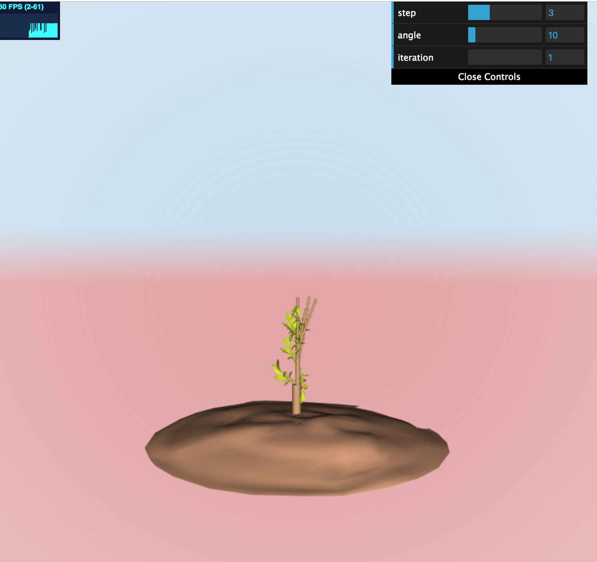
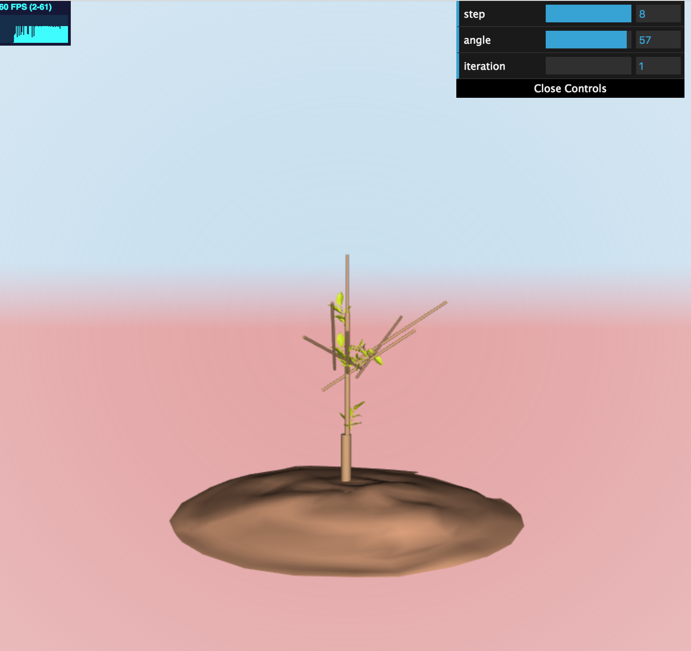
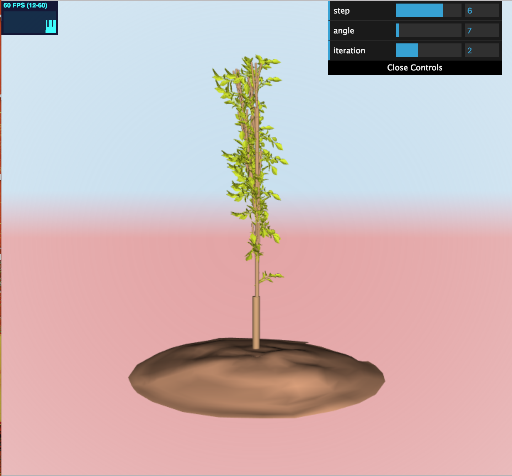
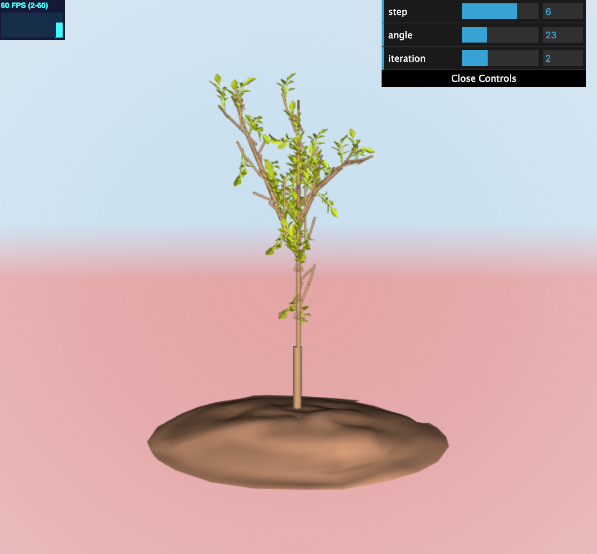
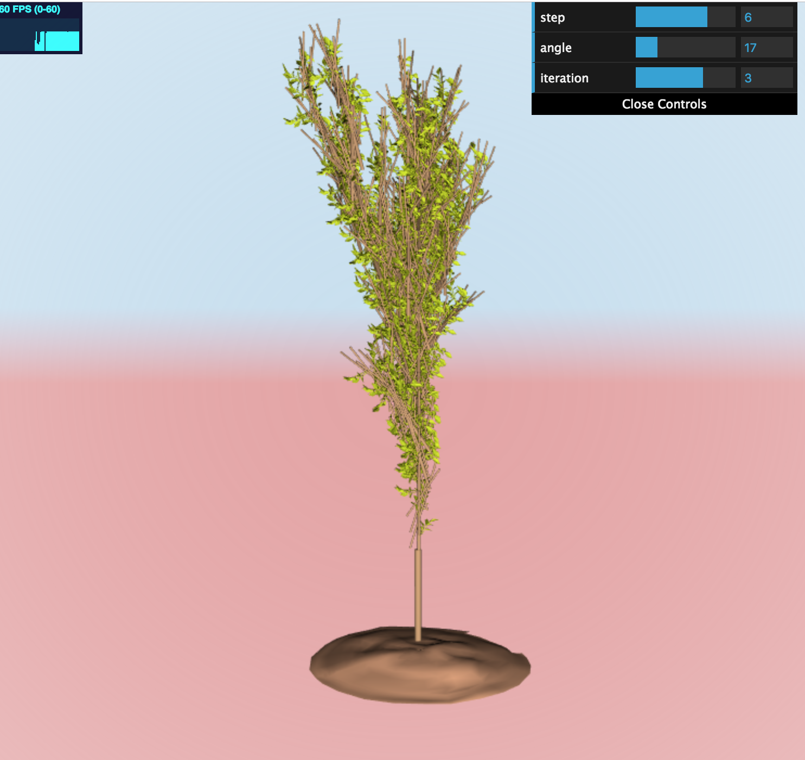
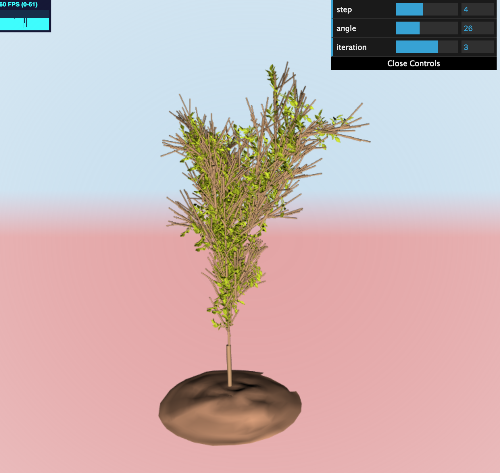
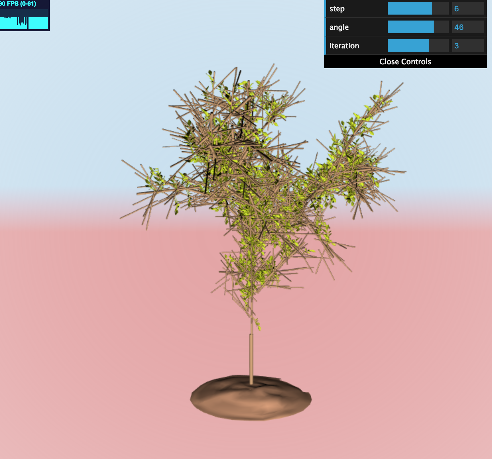

# L-System Tree

### Chloe Le
- https://chloele.com/

### Demo: 
- http://www.chloele.com/lsystem-tree/

1 iteration: 

 

 

2 iterations: 

 

 

3 iterations: 

 

 

 

## References

I referenced CIS 566 lecture [slides](https://cis700-procedural-graphics.github.io/files/lsystems_1_31_17.pdf) and lecture notes for implementation. 
For creating mesh and scene classes, I referenced my past code's logic from CIS 560. 

## Inspiration

## Features Implemented
- Adjustable iterations
- Adjustable step size 
- Adjustable angle size

## Implementation

### Turtle class
The turtle class keeps track of each turtle's orientation, position, and depth. It provides the turtle with the ability to move forward and rotate. 

There is also a TurtleStack class that uses an array data structure for the system to keep track of the state of turtles. 

### Rules

Both expansion rules for the string and drawing rules for the turtle are done using a map from the input string/char to the corresponding rule, each associated with a probability. 

ExpansionRule and DrawingRule class follow a similar logic and methods. They both set up the map structure on construction, and they both have the a get and a set method. 

### Organic variation 
randomness in grammar expansion and drawing operations is applied as explained above. In addition, rotations of the leaves are also randomly generated to ensure organic looking composition.

### L-System Grammar -- Allows for 3D Expansion
 
The grammar utilizes F, X, Y, Z, and B. 

B: draw tree trunk 

F: Move forward, 0.55; Move forward with drawing leaves, 0.45

X: Rotate -X, 0.5; Rotate X, 0.5
    
Y: Rotate -Y, 0.5; Rotate Y, 0.5

Z: Rotate -Z, 0.5; Rotate Z, 0.5

### Loading Scene with OBJ 
The scene consists of three TreeScene objects. One for the ground, one for branches, and on for leaves. The TreeScene has a method for us to add Obj Mesh to the scene, which is created only when the entire scene is ready. 

### Background

Gradient, color contrast, and vignette are applied to the background.

Vignette is done while taking into account the dimension of the window, the uv, and the fall off term. We find the coord, take the square root of the coord's dot product, square that term, and finally take the inverse to get the effect color, which I add to the output.

For contrast, we take the square of the color and multiply that with an adjustable term that subtracts c*color from a float.

For the gradient, I set and mix the color based on the value of uv.y. 

## Future Improvements
If time allows, I would do the following to improve my work
 - curve branches with small segments of cylinders 
 - animate tree-leaf
 - add noise to the background 
